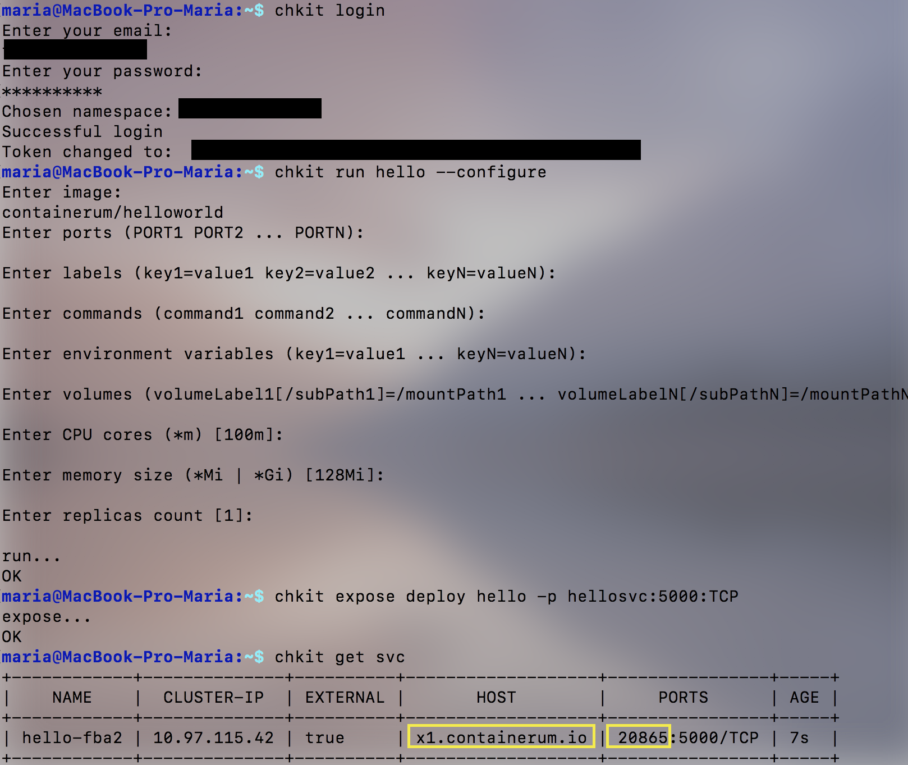
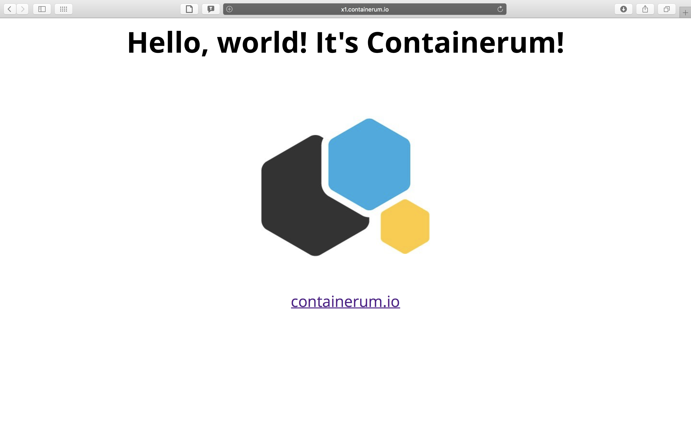

# chkit
Desktop client for [Containerum.com] platform.

To use it sign up on [Containerum.com](https://containerum.com).

## Documentation
[See full ENG documentation](https://github.com/containerum/chkit/wiki)
## Installation

**1.** Download binaries for MacOs, Ubuntu x32, Ubuntu x64, Windows x32 and Windows x64 [here](https://github.com/containerum/chkit/releases).

**2.** Extract the file to any directory.

for **Ubuntu** and **MacOs**:
```
$ tar -xvf your_archive.tar -C /path/to/destination/dir/
```
Run the client from `/path/to/destination/dir/`:
```
$ ./chkit
```
**Note**: 
See how to run the client on Ubuntu/MacOs from any directory and use `chkit`, not `./chkit` command [here](https://containerum.com/documentation/Installing-Containerum-CLI-from-binaries).

## Usage

**1.** Sign Up at [containerum.com](https://containerum.com).

**2.** Open Terminal and run `chkit login`

```
$ chkit login
Enter your email: test@gmail.com
Password:
********
Chosen namespace: mynamespace
Successful login
Token changed to:  QA0u64rOkTtCxxxxxxxxxxliUAnBnPlCbGQfpCQpzqM=
```
Your Terminal should look like this finally:



Follow the next steps bellow.

**3.** Let's deploy any app from the [DockerHub](https://hub.docker.com), let it be [Hello, World! It's Containerum](https://hub.docker.com/r/containerum/helloworld/).

**4.** Use `chkit run` command:
```
$ chkit run hello --configure

Enter image: containerum/helloworld
Enter ports:
Enter labels (key=value ... key3=value3):
Enter commands (command1 ... command3):
Enter environ variables (key=value ... key3=value3):
Enter  CPU cores count(*m):100m
Enter memory size(*Mi | *Gi): 128Mi
Enter  replicas count: 1
run... OK
```
**5.** Use `chkit expose` command:
```
$ chkit expose deploy hello -p hellosvc:5000:TCP

expose... OK
```
**5.** Use `chkit get` command:
```
$ chkit get svc

+------------+--------------+---------+-------------------+----------------+-----+
| NAME       | CLUSTER-IP   | EXTERNAL| HOST              | PORT(S)        | AGE |
+------------+--------------+---------+-------------------+----------------+-----+
| hello-926c | 10.103.95.119| true    | containerum.io    | 20865:5000/TCP | 15s |
+------------+--------------+---------+-------------------+----------------+-----+
```
**6.** Go to http://x1.containerum.io:20865:



Done!
